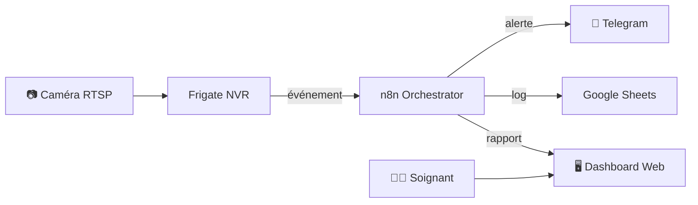

# 🏥 SeniorAssist — Surveillance Santé par n8n

Système complet de supervision pour personnes âgées, construit avec n8n. Combine surveillance vidéo (Frigate), alertes en temps réel, gestion patients et rapports automatisés.

## 🏗️ Architecture

## 📋 Workflows (15)

| Workflow | Description |
|----------|-------------|
| API Patients | CRUD patients via REST API |
| API Rapports | Gestion et consultation des rapports |
| API Événements | Enregistrement des événements de vie |
| Absence Anormale | Détection d'absence prolongée inhabituelle |
| Actions Portail | Actions déclenchées depuis le portail soignants |
| Alertes Temps Réel | Notification immédiate sur événements critiques |
| Camera Proxy | Proxy flux RTSP caméra |
| Dashboard Supervision | Interface de surveillance globale |
| Détection Chute | Détection de chute via analyse vidéo Frigate |
| Interface Web | Portail web principal |
| Log Événements | Journalisation de tous les événements |
| Portail Soignants | Interface dédiée au personnel soignant |
| Rapport Hebdomadaire | Synthèse automatique hebdomadaire |
| Rapport Journalier | Bilan quotidien par patient |
| Surveillance Nocturne | Monitoring renforcé la nuit |

## 🛠️ Stack

- **Orchestration** : n8n self-hosted
- **Vidéo** : Frigate NVR (détection objets/événements) + caméras RTSP
- **Notifications** : Telegram Bot
- **Stockage** : Google Sheets (logs, rapports)
- **IA** : Ollama local (analyse d'images)

## 💻 Prérequis matériels

Frigate nécessite une machine dédiée avec :
- **CPU** : x86_64 recommandé (ARM possible)
- **RAM** : 4 Go minimum (8 Go recommandé)
- **GPU/TPU** : Coral USB Accelerator fortement recommandé pour la détection temps réel
- **Stockage** : SSD pour les enregistrements

> Ce projet tourne sur un serveur local auto-hébergé. Il n'utilise aucun service cloud pour la vidéo (confidentialité).

## 📸 Captures d'écran

> *Screenshots à venir — dashboard soignants, alertes Telegram, rapport journalier*

## 🚀 Import dans n8n

1. Dans n8n → **Workflows** → **Import**
2. Importer les fichiers JSON du dossier `workflows/`
3. Configurer les credentials Telegram et Google Sheets
4. Configurer l'URL Frigate dans les workflows caméra (variable `FRIGATE_URL`)
5. Activer les workflows dans l'ordre
